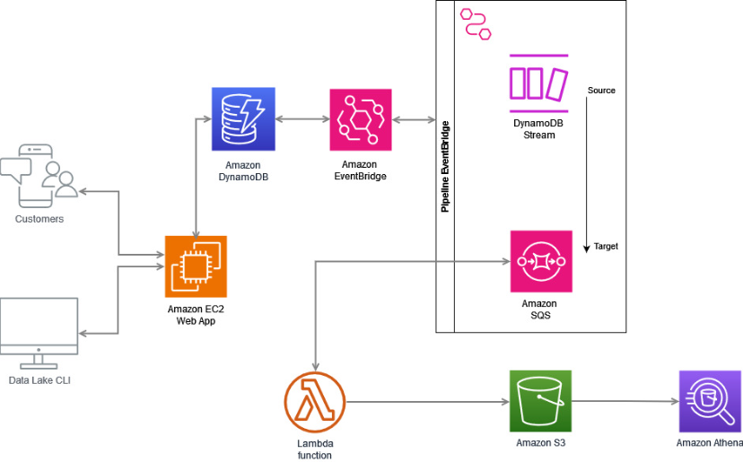

# Documentación del Proyecto End-to-End

## Resumen del Proyecto

Este proyecto tiene como objetivo crear una aplicación web para registrar videojuegos y gestionar los datos utilizando varios servicios de AWS. La aplicación está desarrollada en Python con Flask y utiliza diversas tecnologías y servicios como EC2, DynamoDB, Nginx, Gunicorn, EventBridge, SQS, Lambda, S3 y Athena. La arquitectura del proyecto está diseñada para ser robusta y escalable, permitiendo una gestión eficiente de los datos de los videojuegos.

## Arquitectura del Proyecto

## Descripción del Proyecto

### 1. Creación del Formulario y Backend

- **Formulario en Python y Flask**:
  - Hemos generado un formulario en Python utilizando Flask-WTF. Este formulario permite a los usuarios ingresar información sobre videojuegos, incluyendo título, empresa desarrolladora, género, año de publicación y si es competitivo.
  - **Archivos Involucrados**:
    - **`app.py`**: Define el formulario y las rutas para los métodos GET y POST. También maneja el logging.
    - **`forms.py`**: Define la estructura del formulario utilizando Flask-WTF.

- **Plantillas HTML**:
  - **Formulario**: Un archivo HTML para el formulario donde los usuarios pueden ingresar la información de los videojuegos.
  - **Mensaje de Éxito**: Un archivo HTML que muestra un mensaje de éxito una vez que el videojuego ha sido registrado.
  - **Archivos Involucrados**:
    - **`templates/index.html`**: Contiene el formulario.
    - **`templates/success.html`**: Muestra el mensaje de éxito.

### 2. Configuración del Entorno en EC2

- **Instancia EC2**:
  - Creamos una instancia EC2 donde se guardan todos los archivos necesarios para el proyecto.
  - Configuramos un entorno virtual en la instancia para gestionar las dependencias del proyecto.

- **Conexión a DynamoDB**:
  - Configuramos la instancia EC2 para conectarse a DynamoDB, donde se registran los datos de los videojuegos.
  - **Servicios Utilizados**:
    - **Nginx**: Utilizado como servidor web para manejar las solicitudes entrantes.
    - **Gunicorn**: Utilizado como servidor WSGI para ejecutar la aplicación Flask.

### 3. Gestión de Eventos y Mensajería

- **Amazon EventBridge**:
  - Utilizado para capturar los eventos cuando se registran nuevos videojuegos en DynamoDB.

- **Amazon SQS**:
  - Procesa los mensajes en una cola de mensajería, actuando como trigger para nuestra función Lambda.

### 4. Función Lambda y Almacenamiento en S3

- **Función Lambda**:
  - Se activa cuando se registra un nuevo videojuego. La función Lambda procesa los datos y los guarda en un bucket de S3, realizando las transformaciones necesarias.
  - **Archivo Involucrado**:
    - **`sqs_lambda.py`**: Define la lógica de la función Lambda.

- **Amazon S3**:
  - Almacena los datos transformados de los videojuegos.
  - Utilizamos un bucket para almacenar los datos transformados y otro bucket para almacenar los resultados de las consultas de Athena.

### 5. Consultas con Amazon Athena

- **Amazon Athena**:
  - Realizamos consultas sobre los datos almacenados en S3 para obtener información específica sobre los videojuegos.
  - Guardamos los resultados de estas consultas en un bucket diferente en S3.

## Resumen del Flujo de Datos

1. **Registro de Videojuegos**:
   - Los usuarios ingresan la información de los videojuegos a través del formulario web.
   - Los datos se envían a la aplicación Flask, que los guarda en DynamoDB.

2. **Captura de Eventos**:
   - EventBridge captura el evento de registro y envía un mensaje a SQS.

3. **Procesamiento en Lambda**:
   - SQS activa una función Lambda que procesa los datos y los guarda en un bucket de S3.

4. **Consultas con Athena**:
   - Realizamos consultas sobre los datos almacenados en S3 utilizando Athena.
   - Los resultados de las consultas se almacenan en otro bucket de S3 para su posterior análisis.

## Conclusión

Este proyecto demuestra cómo integrar múltiples servicios de AWS para crear una aplicación web robusta y escalable. La combinación de EC2, DynamoDB, Nginx, Gunicorn, EventBridge, SQS, Lambda, S3 y Athena permite manejar eficientemente el registro, procesamiento y análisis de datos de videojuegos, proporcionando una solución completa end to end.
